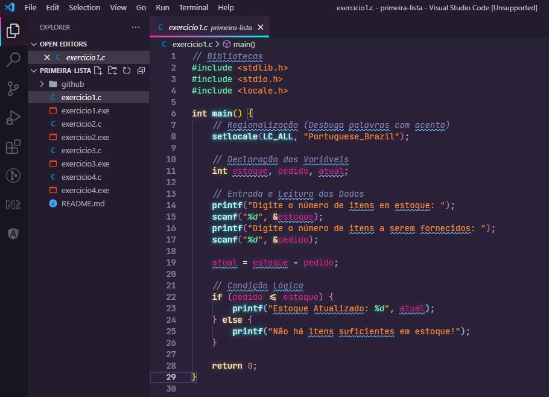

<h1 align="center">
    
</h1>

    <h3> 🔵 Primeira Lista 🔵 </h3>
    
     
    

## Lista 1

Lista de exercícios para praticar algoritmo estruturado e lógica de programação.

## Questões

1.	Escreva um programa que informe se existe estoque para atender um pedido feito a uma fábrica. O programa deverá receber como entradas o número de itens em estoque e o número de itens a serem fornecidos, e dará como saída o estoque atualizado ou uma mensagem indicando não haver itens suficientes em estoque para atender o pedido.
2.	Faça um programa que lê dois valores, o primeiro servindo de indicador de operação e o segundo correspondendo ao raio de uma circunferência. Caso o primeiro valor lido seja igual a 1, calcular e imprimir a área desta circunferência. Se o valor lido for 2, calcular e imprimir o perímetro da circunferência. E se o valor lido for diferente destes dois valores, imprimir uma mensagem dizendo que o indicador de operação foi mal fornecido.
3.	Recebido um código numérico e valores apropriados a cada caso, calcule e imprima:
•	Código Cálculo a ser efetuado
o	1 - área de um quadrado
o	2 - área de um retângulo
o	3 - área de um trapézio
o	4 - um valor informado, elevado à potência indicada
•	Fórmulas:
o	área do quadrado: lado2
o	área do retângulo: base × altura
o	área do trapézio: ((base_maior + base_menor) / 2) * altura
o	cálculo de potência
4.	Dada a altura e peso de uma pessoa, calcular seu índice de massa corporal. Fórmula: peso dividido por altura ao quadrado. Faixas:
<= 18,5 - abaixo do peso normal; 
> 18,5 e <= 25 - peso normal; 
> 25 e <= 30 - peso acima do normal; 
acima de 30 - peso excessivo.

## 🛠️ Linguagem

💻 C

### ☑️ Código:

## 🌟 CEFET / RJ

Essa lista foi passada no meu curso de Sistemas de Informação realizado no CEFET.

